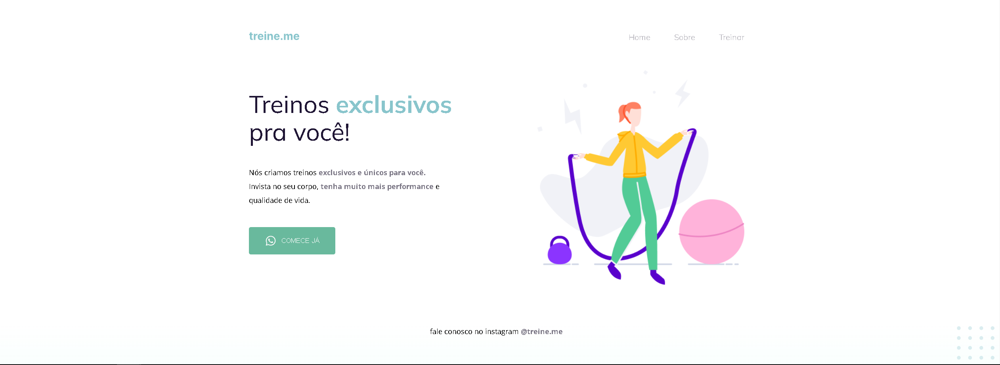

<h1 align="center">
    
    
we create exclusive workouts for you! 🏋️‍♂️

<h1/>

<h1>
    
    <h3 align="center">
        <a href="https://rodrigolima-dev.github.io/treine.me/">VEJA O PROJETO</a>
    <h3/>
<h1/>

## 📕 Sobre
**Treine me** é uma proposta desenvolvida como projeto do curso explorer da **rocketseat**, ainda sem responsividade e programação de fato.

## 🔨 Ferramentas

## 📝 License 
This project is under the MIT license. 